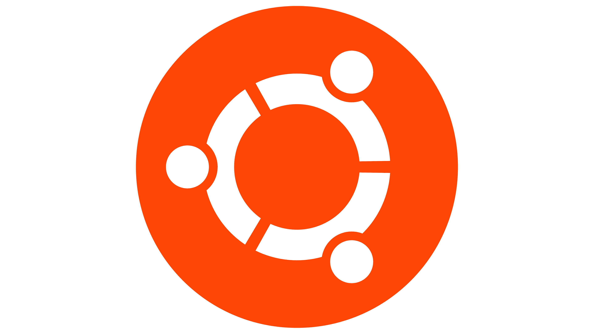
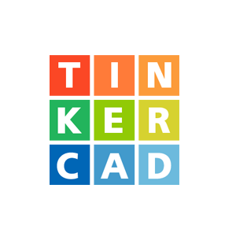

| 🇧🇷 [Português](./README.md) | 🇺🇸 [English](./README.en.md) | 🇯🇵 [日本語](./README.ja.md) | 🇪🇸 [Español](./README.es.md) |
|------------------------------|-----------------------------|----------------------------|--------------------------|
### Olá! Meu nome é Júlia (msjujubr),  
  Estudante de Engenharia de Computação, fascinada pelas áreas de robótica, programação, controle e automação.

- 📌 [Portfolio - Trajetória acadêmica e projetista](https://msjujubr.github.io/portfolio/)
- 🏢 CEFET - Campus V
- 🤖 Grupo PET - Engenharia Mecatrônica

---

---

### 📚 Formação
- 📝 Cursando: Engenharia da Computação, CEFET-MG
- 🤖 Curso de Robótica, FLEEK
- 🖥️ Introdução a Programação e Robótica (PROROBOT), CEFET-MG
- 📓 Técnico em Administração

  
---

---

    
    

---

---

### Plataformas:

    
    
    
    
    
    
    
    
    

 

### Linguagens e Recursos:

    
    
    
       

 

---

---

### Contato:

    
    
   	
    
    
  

  
---
